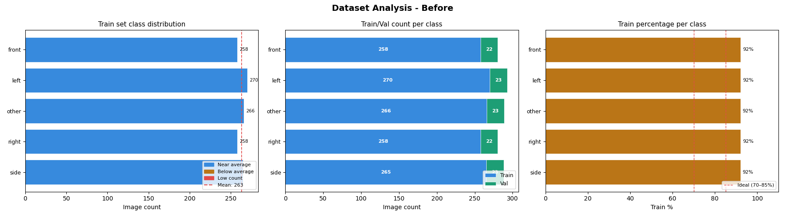
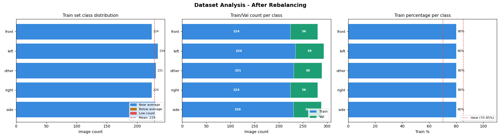

# Dataset Analyzer Image Data classification

Analyze image classification datasets and rebalance train/val split per class by moving files randomly.

This script helps you:
- inspect class-wise train and val counts
- visualize distribution and split quality
- choose target validation percentage
- rebalance each class to the requested split
- regenerate plots and report updated statistics

## Features

- Class-wise dataset analysis for train and val folders
- Text report with split and imbalance summary
- Three analysis plots in one figure:
	- train class distribution
	- train/val count per class
	- train percentage per class
- Interactive or non-interactive balancing workflow
- Random file movement per class between train and val
- Before/after comparison with regenerated plots

## Folder Structure

Your dataset root should look like this:

```text
dataset/
├── train/
│   ├── class_1/
│   ├── class_2/
│   └── ...
└── val/
		├── class_1/
		├── class_2/
		└── ...
```

## Installation

```bash
pip install -r requirments.txt
```

## Usage

### Interactive mode

```bash
python3 dataset_analyzer.py --path /path/to/dataset
```

Flow in interactive mode:
1. Show current dataset analysis and plot
2. Close the plot
2. Ask desired validation percentage
3. Ask confirmation
4. Move files randomly class-by-class
5. Show updated analysis and updated plot

### Non-interactive mode

```bash
python3 dataset_analyzer.py --path /path/to/dataset --val-percentage 20 --yes
```

Arguments:
- --path: dataset root containing train and val folders
- --val-percentage: target val percentage per class (5 to 50)
- --yes: skip confirmation prompt

## Output Files

The script saves plots into the dataset path:

- dataset_analysis_before.png
- dataset_analysis_after.png

## Example Plots

Before balancing:



After balancing:



## Notes

- Files are moved, not copied. This changes dataset contents.
- If a filename already exists in target folder, a safe renamed filename is used.
- Supported image extensions: .jpg, .jpeg, .png, .bmp, .webp, .tiff


